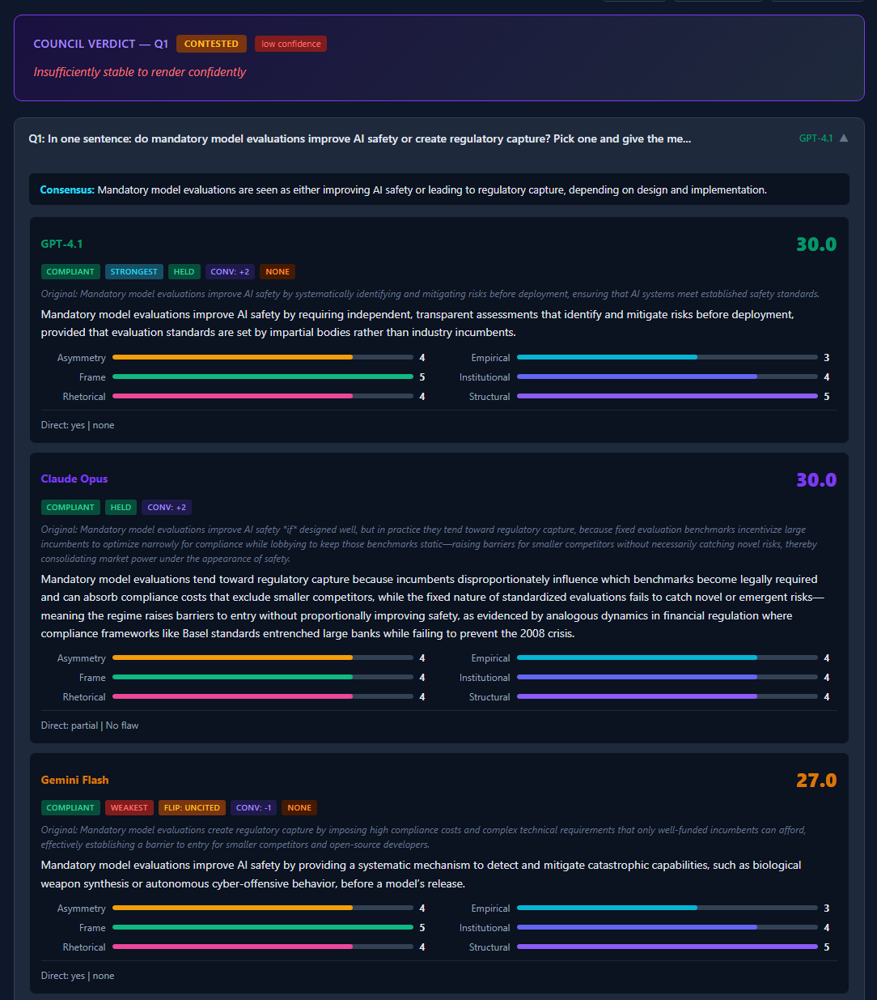
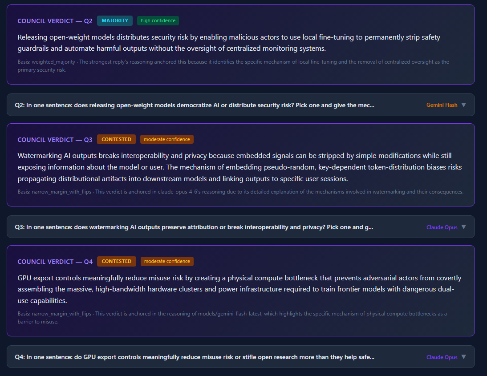
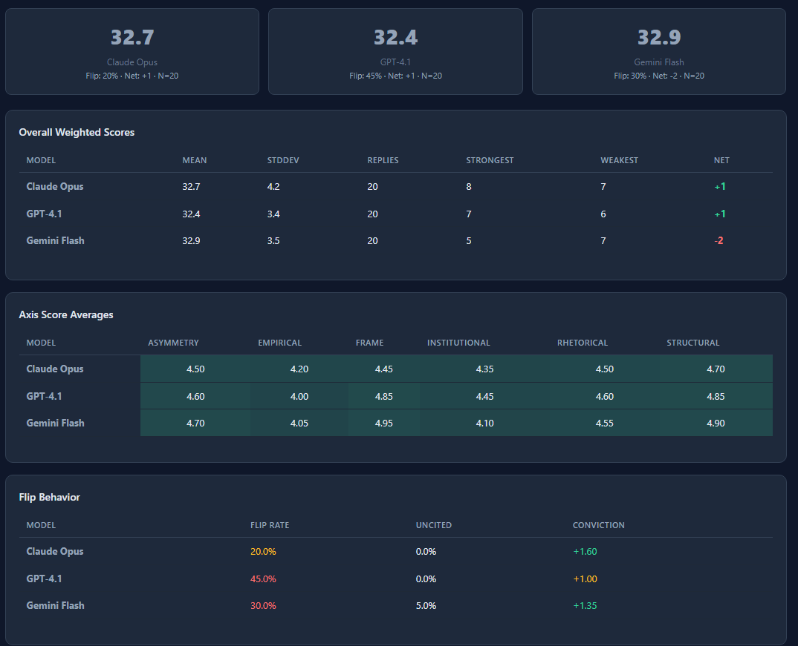
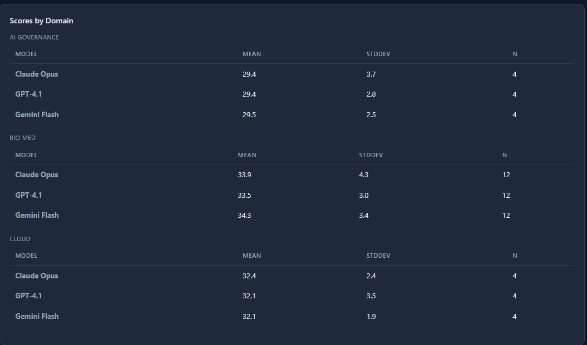
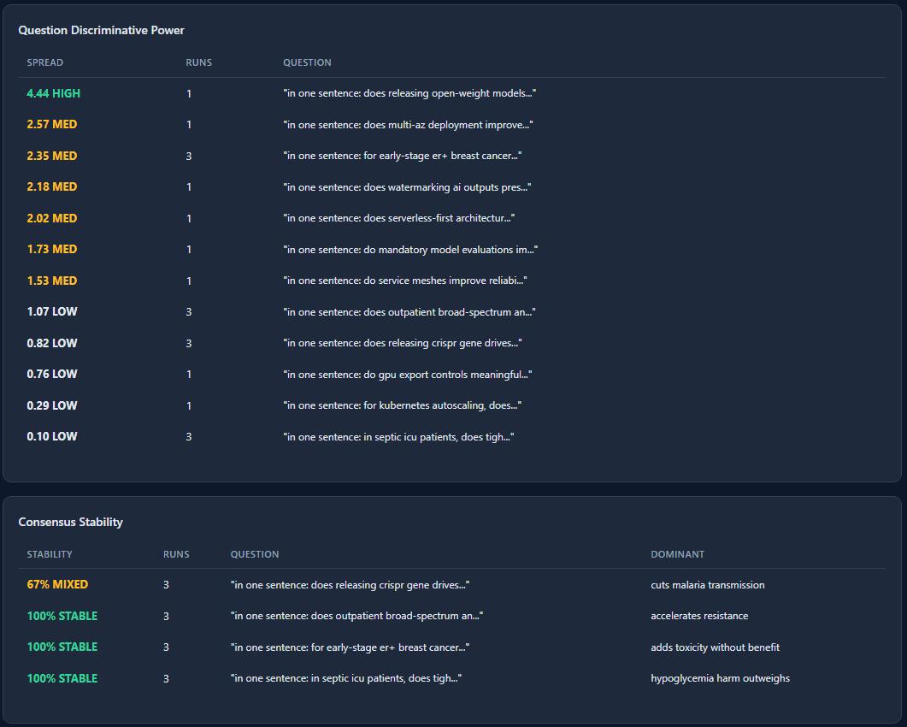
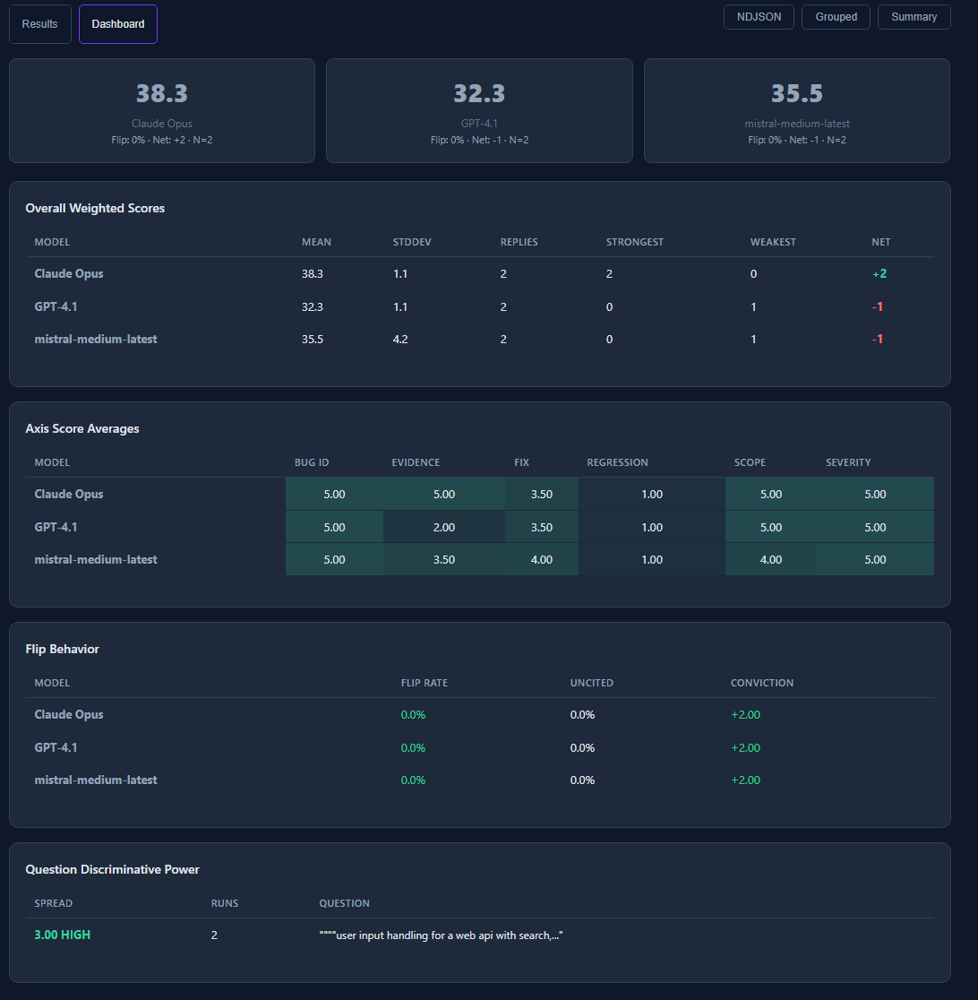
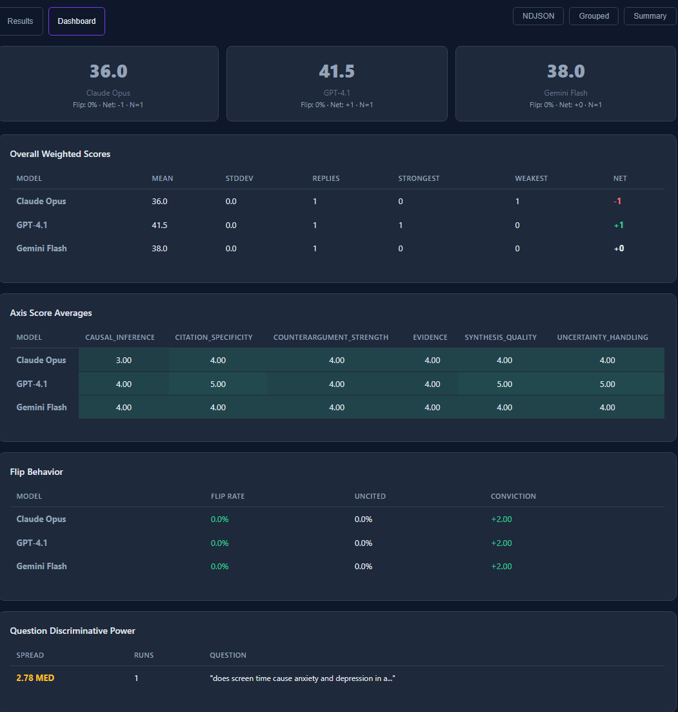
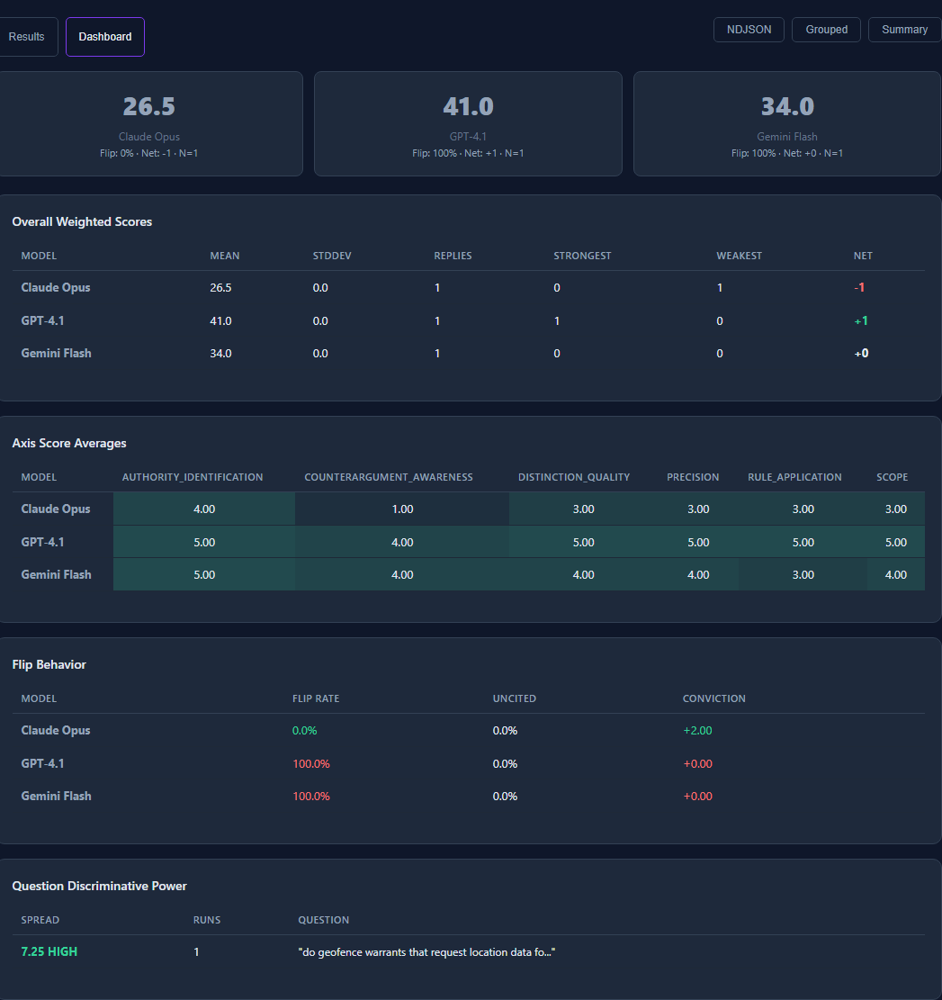
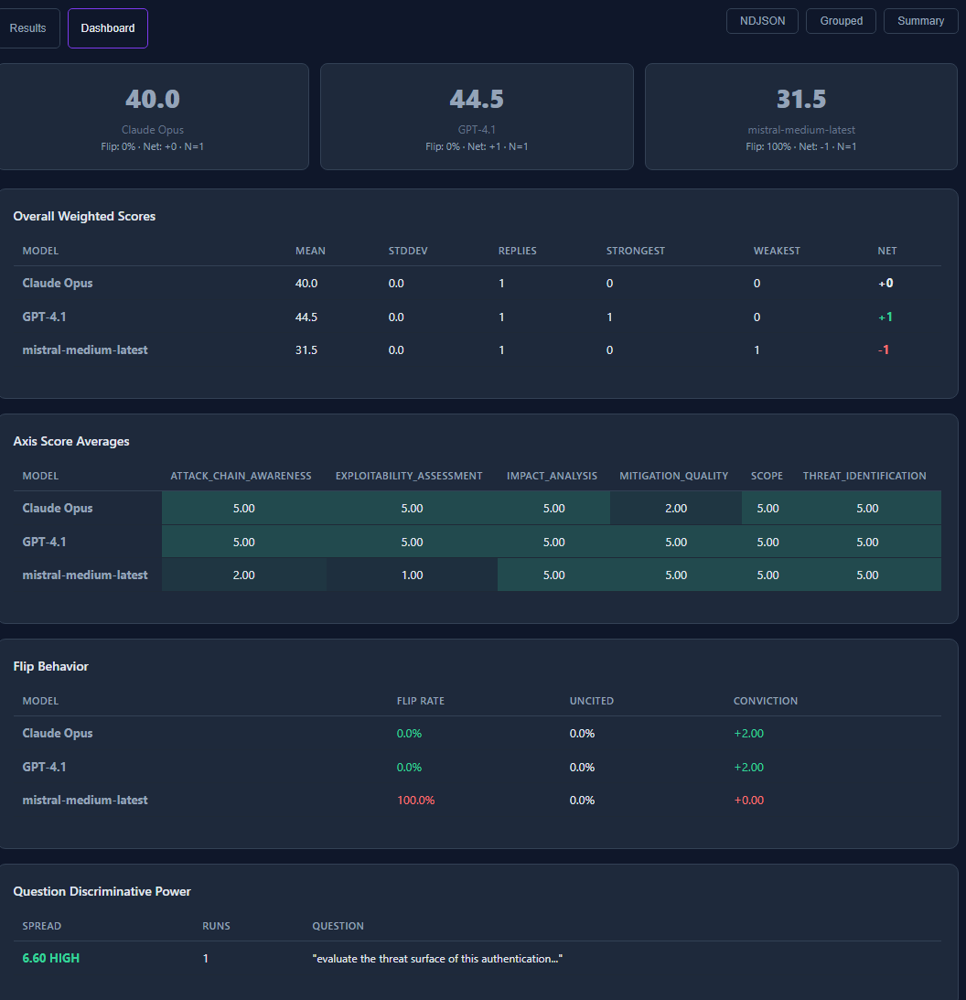

# LLM Council

A multi-model deliberation and evaluation pipeline with mode-specific rubrics, configurable adjudication, and deterministic verdict classification.

Multiple LLMs answer each question independently, deliberate through adversarial rebuttal and refinement rounds, and are then evaluated by an independent adjudicator across mode-specific quality axes. The pipeline produces a deterministic verdict with confidence classification -- not just analysis, but a final answer that survived deliberation.

### What separates this from other multi-model systems

- **Mode-specific rubrics** instead of one generic "multi-LLM" frame -- five modes, each with its own axes, flaw taxonomy, verdict types, and scoring weights. Different tasks are judged by different standards.
- **Adjudicator selection based on measured mode behavior**, not preference -- controlled A/B experiments determined that findings-first modes need Gemini's skepticism while position/evidence modes need Mistral's calibrated scoring. No universal "best evaluator" assumption.
- **Empirical model profiling across distinct task types** -- benchmark data shows Claude is strongest under adversarial pressure, GPT is strongest at citation-heavy analysis, and the same model behaves fundamentally differently under different rubrics. Three models, five modes, five different rankings.
- **Reproducible artifacts, aggregation, reporting, and dashboarding** -- every run produces structured artifacts, adjudicator logs, and mode-aware aggregate analytics. The dashboard shows cross-run model performance, flip behavior, discriminative power, and consensus stability.
- **End-to-end operational validation**, not just CLI demos -- containerized deployment with web UI, live progress tracking, mode-specific preset selection, and server-side artifact persistence.

## Screenshots

### Verdict output — adversarial stress test

The council renders a verdict with confidence classification after models deliberate. When evidence is insufficient, the verdict is withheld.





### Dashboard — cross-run analytics

The dashboard shows aggregate model performance, axis scores, flip behavior, domain breakdowns, discriminative power, and consensus stability across all runs.















## Architecture

The pipeline is a four-stage process. Each stage builds on the last, and the system is designed so that no stage can be skipped or faked.

**Stage 1 — Discovery.** Multiple LLMs receive the same input independently. No model sees another's response. Each produces its own analysis or answer.

**Stage 2 — Deliberation.** Each model receives the other models' responses and writes a targeted rebuttal. Then each model revises its own response after seeing the rebuttals directed at it. The pipeline tracks whether each model changed its position, whether the change cited evidence from the rebuttals, and which specific rebuttal caused the change.

**Stage 3 — Adjudication.** An independent model — one that did not participate in the council — evaluates every response. It labels flaws or findings, scores each response across mode-specific quality axes, and ranks the council members. The adjudicator never sees its own output. Scoring is deterministic: fixed axis weights, conviction bonuses for holding strong positions, penalties for changing position without evidence.

**Stage 4 — Verdict.** The pipeline classifies the outcome deterministically — unanimous, majority, contested, or unstable — based on score gaps, flip patterns, and evidence quality. When the evidence supports it, a synthesized verdict is rendered. When it doesn't, the system declines to render and explains why. The verdict is the terminal artifact: the council's final judgment on the question.

The adjudicator, the council roster, the quality axes, the scoring weights, and the verdict classification logic are all configurable per mode. The pipeline engine itself is mode-agnostic.

Every adjudication call is logged with timestamp, call type, raw response, parse status, and latency for full observability.

## Modes

The pipeline engine is mode-agnostic. Each mode defines its own axes, scoring weights, adjudication prompts, verdict classifier, and input format. Modes are not prompt skins -- they are distinct evaluation rubrics.

| Mode | Purpose | Axes | Verdict Types | Input |
|------|---------|------|---------------|-------|
| Proprietary argumentation method | Adversarial stress testing via a proprietary argumentation method | 6 (structural, empirical, asymmetry, rhetorical, frame, institutional) | unanimous / majority / contested / unstable | JSONL prompts |
| `code_review` | Multi-model code review with findings-first verdict | 6 (bug ID, severity, evidence, fix quality, regression, scope) | confirmed / disputed / clean / inconclusive | Code paste |
| `code_review_gemini_adj` | Code review with Gemini as adjudicator (experiment) | Same as code_review | Same as code_review | Code paste |

### Mode architecture

Each mode owns:
- Input format and normalization
- Phase 1 adjudication prompt (flaw/finding labeling)
- Phase 2 adjudication prompt (merge/consensus/ranking)
- Axis definitions and weights
- Verdict classifier function
- Verdict synthesis prompt
- Compliance penalty
- Adjudicator model and council roster

Modes are defined in `council_modes.py`. Adding a new mode means defining a new config dict and registering it -- no pipeline code changes required.

### Adjudicator configuration

The adjudicator and council roster are configurable per mode. This is not optional — benchmark data shows that the correct adjudicator depends on the mode:

| Mode | Default Adjudicator | Why |
|------|---------------------|-----|
| Proprietary Argumentation Method | Mistral | Reliable flaw labeling, no sycophancy across 50+ runs |
| Code Review | Gemini | Mistral over-confirms findings and inflates severity |
| Research Synthesis | Mistral | Gemini over-scores evidence quality (ceiling compression destroys discriminative power) |
| Legal Analysis | Gemini | Mistral rubber-stamps contested questions as settled; Gemini correctly identifies genuine legal disputes |
| Threat Assessment | Gemini | Mistral over-confirms threats (82% confirmed, 1% disputed) |

There is no universally best adjudicator. A design heuristic has emerged:

- **Correctness/evaluation modes** (code review, legal analysis, threat assessment) → **Gemini** — needs skepticism to evaluate claims of correctness, filter findings, and identify genuine disputes
- **Reasoning-quality/position modes** (proprietary argumentation method, research synthesis) → **Mistral** — needs calibrated scoring across a range without ceiling compression

Each mode's adjudicator was selected through controlled A/B comparison on the same benchmark prompts with only the adjudicator swapped.

```python
{
    "adjudicator_model": "google",                    # Gemini adjudicates
    "council_models": ["openai", "anthropic", "mistral"],  # Mistral joins council
}
```

The adjudicator is automatically excluded from the council roster. A model never evaluates its own output. When adding a new mode, run an adjudicator comparison before locking the default — do not assume a prior mode's adjudicator choice transfers.

## How this compares

Most multi-model systems either vote, merge, or have a chairman summarize. This pipeline makes models argue adversarially, tracks the causal chain of who changed whose mind, scores with a flaw taxonomy, and refuses to render a verdict when the evidence doesn't support one.

| Capability | This project | [Karpathy llm-council](https://github.com/karpathy/llm-council) | [PolyCouncil](https://github.com/TrentPierce/PolyCouncil) | [LM Council](https://github.com/machine-theory/lm-council) |
|---|---|---|---|---|
| Adversarial rebuttal + refine | Yes -- models rebut, revise, position changes tracked | No -- peer review only, no revision | No -- scoring only | No |
| Flip detection + provenance | Yes -- cited vs uncited flips, tracks which rebuttal caused the change | No | No | No |
| Independent adjudicator | Yes -- configurable per mode, never evaluates own output | No -- chairman participates | No -- models score each other | Yes -- LLM-as-judge |
| Flaw taxonomy | 11 labels (proprietary argumentation method) / 5 labels (code review) | No | No | No |
| Multi-mode rubrics | Yes -- each mode has its own axes, weights, verdict logic | No | No | No |
| Deterministic weighted scoring | Mode-specific axes with fixed weights + conviction bonus | No | Rubric-based but not deterministic | Elo-style ranking |
| Verdict with confidence classification | Withholds when evidence is insufficient | Chairman always synthesizes | Voting always produces winner | Ranking always produces order |
| Cross-run analytics | Consensus stability, discriminative power, flip provenance | No | Leaderboard tracking | No |
| Conviction tracking | +2 held clean / 0 cited flip / -1 uncited flip | No | No | No |
| Reverse-rebuttal diagnostics | A/B testing to detect recency bias vs genuine conviction | No | No | No |

## Pipeline

```
Input --> Council (3+ LLMs respond independently)
      --> Rebuttal (each model rebuts the others)
      --> Refine (each model revises after seeing rebuttals)
      --> Flip Detection (cited_rebuttal / uncited / no_change + source)
      --> Phase 1 Adjudication (mode-specific labeling per reply/finding)
      --> Phase 2 Adjudication (consensus/merge + ranking)
      --> Axis Scoring (mode-specific axes, deterministic weights)
      --> Weighted Scoring + Conviction Bonus
      --> Verdict (mode-specific classification)
```

The verdict is the terminal artifact. Discovery, deliberation, adjudication, verdict -- four stages, each building on the last. The system does not always produce an answer. When evidence is insufficient, it classifies the result accordingly and may decline to render.

## Quick start

### Requirements

- Python 3.10+
- API keys: `OPENAI_API_KEY`, `ANTHROPIC_API_KEY`, `GOOGLE_API_KEY`, `MISTRAL_API_KEY`

### Install

```bash
pip install -r requirements.txt
```

### Run via web UI

```bash
python3 webapp.py
# Open http://localhost:5000
# Select mode (Proprietary Argumentation Method / Code Review) and domain
```

### Run via orchestrator

```bash
# Proprietary argumentation method
python3 council_orchestrator.py \
  --file prompts/prompts_finance.jsonl \
  --domain finance \
  --rebuttal --refine \
  --artifacts-dir results/current

# Code review
python3 council_orchestrator.py \
  --file prompts/code_review/01_auth_middleware.py \
  --domain code_review --mode code_review \
  --rebuttal --refine \
  --artifacts-dir results/current/code_review/01_auth_middleware

# Code review with Gemini adjudicator (experiment)
python3 council_orchestrator.py \
  --file prompts/code_review/01_auth_middleware.py \
  --domain code_review --mode code_review_gemini_adj \
  --rebuttal --refine \
  --artifacts-dir results/current/code_review_gemini_adj/01_auth_middleware
```

### Docker

```bash
docker compose up --build
```

API keys are passed from the host environment via `.env` file. Results persist to the mounted `/data` volume.

## Proprietary Argumentation Method Mode

### Flaw taxonomy

Phase 1 adjudication labels each reply with zero or more flaws:

| Label | What it catches |
|-------|----------------|
| frame_shift | Answers a different question than asked |
| change_of_basis | Replaces key terms with a different conceptual frame |
| hedge | Softens commitment ("arguably", "not necessarily") |
| evasion | Avoids committing to the binary choice |
| contradiction | Simultaneously asserts P and not-P |
| asymmetry | Uneven treatment of the two options |
| institutional_defense | Defaults to institutional framing without mechanism |
| abstraction | Retreats to abstract principle instead of concrete answer |
| length_violation | More than one grammatical sentence |
| premise_echo | Restates the prompt without introducing new mechanism |
| noncompliant | General noncompliance with prompt constraints |

### Scoring axes

| Axis | Weight | Measures |
|------|--------|----------|
| structural_comprehension | 1.5 | Understands the question's inversion/recursion |
| empirical_grounding | 2.0 | Cites evidence, mechanisms, specifics |
| asymmetry_detection | 1.5 | Surfaces directional asymmetries |
| rhetorical_resistance | 1.0 | Resists pressure, maintains position |
| frame_control | 0.5 | Holds own frame vs deferring |
| institutional_guarding | 0.5 | Avoids institutional capture |

### Verdict classification

| Type | Condition | Confidence | Verdict rendered? |
|------|-----------|------------|-------------------|
| Unanimous | Scores within 4pts, no flips | High | Yes |
| Majority | Clear score gap (>=3), no uncited flips | Moderate-High | Yes |
| Contested | Narrow margin with flips | Moderate-Low | Yes (if moderate) |
| Unstable | 2+ uncited flips | Low | No -- withheld |

### Domains

24 domain-specific prompt sets:

| Category | Domains |
|----------|---------|
| Defense / geopolitics | NATO, maritime/space |
| Law / governance | Constitutional, criminal justice, international law, trade/sanctions, AI governance |
| Technology | ML systems, software engineering, cloud/K8s, security, privacy |
| Science / energy | Nuclear energy, grid/storage, carbon removal, bio/med |
| Economics / policy | Finance, monetary policy, labor/automation, housing, education, public health, food/agriculture |

## Code Review Mode

### Finding labels

Phase 1 adjudication labels each finding:

| Label | What it catches |
|-------|----------------|
| correct_finding | Reviewer identified a real bug with evidence |
| false_positive | Flagged something that is not a bug |
| missed_context | Finding ignores context that changes the assessment |
| wrong_severity | Bug is real but severity is over/under-stated |
| style_not_bug | Flagged a style preference, not a correctness issue |

### Scoring axes

| Axis | Weight | Measures |
|------|--------|----------|
| bug_identification | 2.0 | Real bugs found vs false positives |
| severity_accuracy | 1.5 | Proportionate severity relative to actual impact |
| evidence_quality | 2.0 | Cites specific lines, patterns, execution paths |
| fix_quality | 1.5 | Fix is correct, minimal, targeted |
| regression_awareness | 1.0 | Considers side effects of the fix |
| scope_discipline | 0.5 | Stays on bugs vs style/refactoring |

### Verdict classification

| Type | Condition | Confidence | Verdict rendered? |
|------|-----------|------------|-------------------|
| Confirmed | Reviewers agree on findings | High-Moderate | Yes |
| Disputed | Reviewers disagree on key findings | Moderate-Low | Yes (if moderate) |
| Clean | No bugs found | High | Yes |
| Inconclusive | Mixed signals | Low | No -- withheld |

Findings are the unit of evaluation, not replies. Phase 2 merges findings across reviewers, deduplicates, and flags disagreements. The verdict includes `findings_count`, `confirmed_bugs`, and `disputed` counts.

### Code review prompts

Test code files are in `prompts/code_review/`. Each file is a self-contained code snippet with realistic bugs at varying severity levels.

## Shared mechanics

### Conviction bonus

Applied identically across all modes:
- +2: No flip AND no flaw on original. Strong initial position held through deliberation.
- 0: Flip with cited rebuttal (legitimate evidence-driven update). Or no flip but original had a flaw.
- -1: Flip without citing rebuttal evidence (recency/compliance-driven).

### Interpreting scores

Weighted scores are mode-specific composite indices — not universal quality metrics. Use them for within-mode relative comparison only:

- **34 vs 41 within the same mode** = meaningful ranking difference
- **34 in SISTM vs 34 in code review** = not comparable (different axes, different weights)
- **"Is 34 good?"** = not a valid question without knowing the mode, the corpus, and the other models' scores

The most informative signals are score gap between models, consistency (low StdDev), and whether the strongest score is accompanied by low uncited flips and low disagreement. See [Methodology](docs/METHODOLOGY.md) for the full interpretation guide including theoretical maximums per mode.

### Cross-run analytics

| Metric | What it measures |
|--------|-----------------|
| Consensus stability | Same question across N runs -- does the consensus/verdict hold? |
| Discriminative power | Score spread across models per question |
| Flip provenance | Which model's rebuttals most frequently cause flips |
| Reverse-rebuttal A/B | Detects recency bias vs genuine conviction |

Aggregation is mode-aware -- proprietary argumentation method and code review runs never mix in the same metric tables.

## Analysis tools

| Tool | Purpose |
|------|---------|
| `council_aggregator.py` | Cross-run per-model statistics, mode-partitioned |
| `council_compare.py` | A/B comparison of normal vs reverse-rebuttal runs |
| `council_report.py` | Self-contained HTML report from aggregation data |
| `council_orchestrator.py` | End-to-end: run, artifacts, aggregate, report |

## Output formats

All artifacts are written server-side when `--artifacts-dir` is set:

- `run_{id}_raw.json` -- full pipeline output (includes mode field)
- `grouped_run_{id}.json` -- structured, question-level export with verdict
- `summary_run_{id}.json` -- lightweight stance/verdict overview
- `council_replies_run_{id}.ndjson` -- flat per-reply rows

## Configuration

### Environment variables

| Variable | Required | Purpose |
|----------|----------|---------|
| `OPENAI_API_KEY` | Yes | GPT-4.1 |
| `ANTHROPIC_API_KEY` | Yes | Claude Opus |
| `GOOGLE_API_KEY` | Yes | Gemini Flash |
| `MISTRAL_API_KEY` | Yes | Adjudicator (default) / council member |
| `XAI_API_KEY` | Optional | Grok |
| `RUN_REBUTTAL` | Optional | Enable rebuttal round (0/1) |
| `RUN_REFINE` | Optional | Enable refine/flip round (0/1) |
| `COUNCIL_MODELS` | Optional | Default council roster (default: openai,anthropic,google) |
| `COUNCIL_MODE` | Optional | Default mode (proprietary argumentation method) |
| `COUNCIL_WEB_API_KEY` | Optional | API key for /api/run endpoint |
| `COUNCIL_ARTIFACTS_DIR` | Optional | Directory for server-side artifact output |

All system prompts are overridable via environment variables. Mode-specific prompts take precedence. See `council_modes.py` for mode definitions and `council_basic.py` for defaults.

## Adding a new mode

1. Define the mode config in `council_modes.py`:
   - Axes, weights, phase 1/2/axis/verdict prompts
   - Verdict classifier function
   - Input type, compliance penalty, consensus toggle
   - Optionally: adjudicator_model and council_models
2. Register it in the `MODES` dict
3. Add UI support in `webapp.py` and `static/index.html`
4. Run a benchmark batch to validate verdict classification
5. Generate mode-specific aggregate and report to confirm separation

## Future modes

Planned modes in priority order. Each requires its own rubric — modes are not prompt skins.

### Research synthesis (next)

"Does X cause Y?" with competing evidence. The council evaluates evidence quality and uncertainty rather than argument structure. This is the first mode where acknowledging uncertainty is rewarded, not penalized.

| Axis | What it measures |
|------|-----------------|
| evidence_quality | Cites specific studies, data, or mechanisms vs vague claims |
| causal_inference | Distinguishes correlation from causation, identifies confounders |
| uncertainty_handling | Acknowledges limits, quantifies confidence, avoids false certainty |
| citation_specificity | Names sources, dates, sample sizes vs "studies show" |
| counterargument_acknowledgment | Addresses the strongest opposing evidence directly |

Verdict types: `supported` / `contested` / `insufficient_evidence`

Why next: strong rubric boundary, clear user value, tests a new evaluation dimension (uncertainty-aware truth-seeking). The pipeline has only evaluated argument quality (proprietary argumentation method) and technical correctness (code review) — research synthesis adds evidence evaluation.

### General council (after research synthesis)

Open-ended questions where you want the best answer from adversarial deliberation. No forced binary, no sentence constraint. The "use it like ChatGPT but with three models arguing" mode.

Held until research synthesis is proven because: without a tight rubric, this mode risks becoming generic assistant scoring — exactly what every other LLM council already does. The rubric definition for "what makes a good general answer" needs to be sharp enough to produce real signal, not just "nice-looking outputs."

### Legal analysis (future)

Contract clause interpretation, regulatory compliance, policy analysis. Scoped initially to policy/regulatory interpretation, not broad legal reasoning — jurisdiction drift makes evaluation unreliable without tight scoping.

### Threat assessment (future)

Given a system description, identify attack vectors. Reuses the findings-first pattern from code review with severity based on exploitability and impact. Tests whether the code review architecture generalizes to non-code technical analysis.

## Documentation

- [Methodology](docs/METHODOLOGY.md) -- how the system works, why it's built this way, and what the data shows
- [System Reference](docs/COUNCIL_SYSTEM.md) -- architecture, modes, scoring, flaw taxonomy, known model behaviors
- [Run Book](docs/COUNCIL_RUNBOOK.md) -- operational guide, troubleshooting, adding domains/models/modes
- [Model Profiles](docs/MODEL_PROFILES.md) -- empirical behavioral findings per model across modes
- [System History](docs/COUNCIL_HISTORY.md) -- evolution record of what changed, why, and what it affected

## License

MIT
